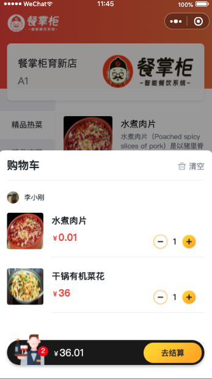

# 鑫龙外卖 - 微信小程序端

## 项目概述

鑫龙外卖是一个基于 `uni-app` 框架开发的微信小程序外卖点餐系统，为用户提供完整的在线点餐体验。该项目实现了从菜品浏览、购物车管理到订单提交的完整业务流程，支持实时多人协同点餐功能。

## 核心特性

### 🍽️ 完整点餐流程
- 菜品分类浏览与搜索
- 菜品详情查看（含图片、描述、价格）
- 多规格选择（辣度、口味等自定义选项）
- 购物车实时管理（添加、删除、数量调整）
- 订单备注功能

### 👥 多人协同点餐
- 基于WebSocket的实时购物车同步
- 支持多人同时为同一桌台点餐
- 实时更新各用户点餐状态

### 🔐 安全认证
- 微信授权登录
- Token认证机制
- 用户信息保护

### 📱 现代化UI设计
- 响应式布局适配
- 流畅的交互动画
- 直观的操作体验

## 技术架构

### 前端技术栈
- **框架**: uni-app (跨平台开发框架)
- **语言**: Vue.js (渐进式JavaScript框架)
- **状态管理**: Vuex
- **UI组件**: uni-ui
- **网络通信**: WebSocket + HTTP RESTful API
- **开发工具**: HBuilderX

### 后端集成
- RESTful API接口对接
- WebSocket实时通信
- 图片资源CDN加速

## 功能模块

### 用户端功能
1. **首页展示**
   - 店铺信息展示
   - 营业状态显示
   - 菜品分类导航
   - 热门菜品推荐

2. **点餐系统**
   - 菜品详情页
   - 规格选择器
   - 购物车管理
   - 实时价格计算

3. **订单管理**
   - 订单提交流程
   - 订单状态跟踪
   - 历史订单查看
   - 再来一单功能

4. **个人中心**
   - 用户信息管理
   - 收货地址管理
   - 个人资料设置

### 商家端集成
- 实时订单接收通知
- 订单状态更新
- 营业状态管理

## 项目亮点

### 🚀 高性能优化
- 图片懒加载
- 组件按需加载
- 网络请求缓存策略

### 🛡️ 安全保障
- HTTPS加密传输
- 敏感信息保护
- 输入验证与过滤

### 🎨 用户体验
- 流畅的动画效果
- 直观的操作引导
- 响应式设计适配

## 部署与运行

### 环境要求
- HBuilderX 3.0+
- 微信开发者工具
- Node.js 12.0+

### 快速开始
1. 克隆项目代码
2. 在HBuilderX中导入项目
3. 配置微信小程序AppID
4. 设置后端API地址
5. 运行到微信开发者工具

### 配置说明
```javascript
// 配置文件位置: utils/env.js
// 测试环境
export const baseUrl = 'https://your-api-domain.com'

// 生产环境建议使用环境变量配置
```

## 安全注意事项

项目中包含测试用的硬编码参数，请在生产环境中：
1. 替换为动态获取的参数值
2. 将敏感配置移至环境变量
3. 启用HTTPS加密传输

## 贡献与支持

### 贡献指南
欢迎提交Issue和Pull Request来帮助改进项目：
1. Fork项目到个人仓库
2. 创建功能分支
3. 提交代码更改
4. 发起Pull Request

### 技术支持
- 查看文档和FAQ
- 提交GitHub Issue
- 联系项目维护者

## 许可证

本项目采用MIT许可证，详情请查看[LICENSE](LICENSE)文件。

## 项目截图

<div style="display: flex; flex-wrap: wrap; gap: 10px;">
  
  
  
  
</div>

## 相关项目

- [鑫龙外卖后台管理系统](https://github.com/your-company/sky-take-out-admin)
- [鑫龙外卖商家端小程序](https://github.com/your-company/sky-take-out-merchant)

---
<p align="center">
  <a href="https://github.com/your-company/sky-take-out-user-mp/issues">报告问题</a> •
  <a href="https://github.com/your-company/sky-take-out-user-mp/pulls">贡献代码</a> •
  <a href="mailto:your-email@company.com">联系我们</a>
</p>